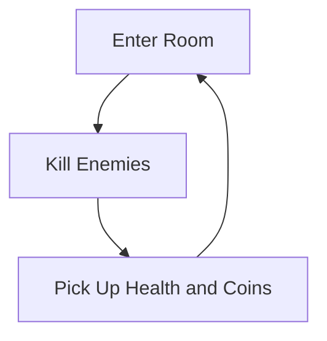

# Game Development Project

### Game Loop
diagram(s) provided by [mermaid](https://mermaid-js.github.io/mermaid/#/classDiagram)
<!-- https://mermaid-js.github.io/mermaid-live-editor -->

The game loop is enter a room, kill enemies (by launching yourself with the grappling hook or throwing bombs), pick up health and coins, then move to the next room.
It is a roguelike similar to Enter the Gungeon or Binding of Isaac, but a grappling hook is your main weapon.
The aim is to collect the most coins by defeating as many enemies as you can before dying.

### External Resources / Assets:
links to any libraries or asset origin.
https://0x72.itch.io/dungeontileset-ii?download

### AI tools
We did not use any AI tools for the project.

### Instructions
instructions on how to play/demonstrate the game.

### Demonstrate the Game
1. Open game
1. Go to options (observe control scheme)
1. Select difficulty (hard is not recommended)
1. Back
1. Clear two or three rooms, using grappling, launching, and binding entities, grappling can affect pillars they're not purely an aesthetic thing, throw bombs at enemies
1. Let yourself die
1. Click restart
1. Press escape to pause

