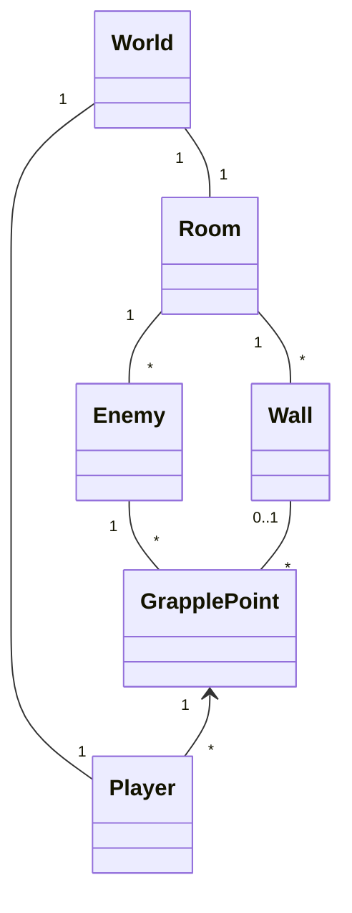

# Game Development Project

UML class diagram provided by mermaid

```mermaid
classDiagram

    class World
    class Room
    class Wall
    class Player
    class Enemy
    class GrapplePoint

    World "1" -- "1" Room
    World "1" -- "1" Player
    Enemy "1" -- "*" GrapplePoint
    GrapplePoint "1" <-- "*" Player
    Wall "0..1" -- "*" GrapplePoint
    Room "1" -- "*" Enemy
    Room "1" -- "*" Wall

```
