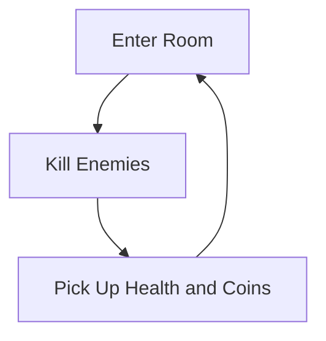

# Game Development Project

### Game Loop
diagram(s) provided by [mermaid](https://mermaid-js.github.io/mermaid/#/classDiagram)
<!-- https://mermaid-js.github.io/mermaid-live-editor -->

The game loop is enter a room, kill enemies (by launching yourself with the grappling hook or throwing bombs), pick up health and coins, then move to the next room.
It is a roguelike similar to Enter the Gungeon or Binding of Isaac, but a grappling hook is your main weapon.
The aim is to collect the most coins by defeating as many enemies as you can before dying.

### External Resources / Assets:
* [Tileset, pillars, and enemies](https://0x72.itch.io/dungeontileset-ii?download)
* [Player character](https://aamatniekss.itch.io/fantasy-knight-free-pixelart-animated-character)
* [Fonts](https://github.com/dalton5000/Godot-Fontpack/)
* [Godot-CI Docker Image](https://gitlab.com/barichello/godot-ci)

### AI tools
We did not use any AI tools for the project.

### Instructions
This project uses gitlab cicd in pair with the Godot-CI docker image specified above to automatically export the project to an executable file (or there approximately) this method is operating system dependent. 
The executables can be downloaded from the cicd pipeline artifacts: 
1. CI/CD in left sidebar
1. Pipelines
1. branch
1. branch name main
1. [(or go here)](https://gitlab.ecs.vuw.ac.nz/course-work/comp313/2022/assignments/hethertren/game-development-project/-/pipelines?scope=branches&page=1&ref=main)
1. click the download button on the right-hand side and select the right OS-based artifacts
1. If the artifacts are not there / the option is not available, re-run the pipeline by clciking on the passed button and then manually running the job

### Demonstrate the Game
1. Open game
1. Go to options (observe control scheme)
1. Select difficulty (hard is not recommended)
1. Back
1. Clear two or three rooms, using grappling, launching, and binding entities, grappling can affect pillars they're not purely an aesthetic thing, throw bombs at enemies
1. Let yourself die
1. Click restart
1. Press escape to pause

### Videos
* [Chair Knight Gameplay Video](https://youtu.be/3aINhSnYQqE)
* [Chair Knight Code Documentation Video](https://youtu.be/zVFkdZ0amuI)
